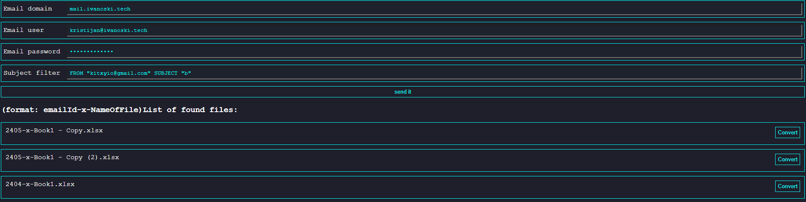
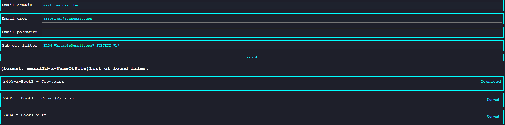

# How to use

## Deployment

copy all files to specified location.
Note: PLEASE MAKE SURE YOUR OS IS 64 BIT WINDOWS, if u require to run this on linux msg me to give you runnable linux version.

## How to use the page

The following fields are required:

-   Email domain
-   Email user
-   Email password
-   Subject filter

Subject filter accepts this values [read more here](https://www.php.net/manual/en/function.imap-search.php)

Conversion is possible up to excel 20xx to 2003.

_Note: Additional conversions can be requested here on github._

**Note: This is intended for single user interaction, multi user model can be made as well but too bored to write it**

## Preview

---

---

## Multi platform

Multi platform exe can be found under /ConvertExcelMultiPlatformExes

Move according to your platform under /helpers

Default win x86
